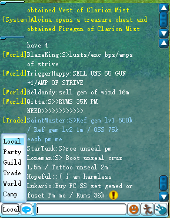
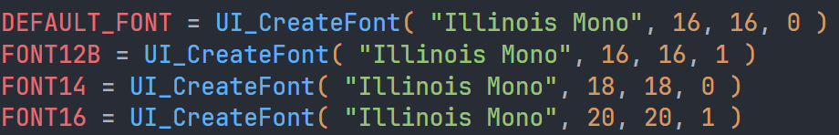
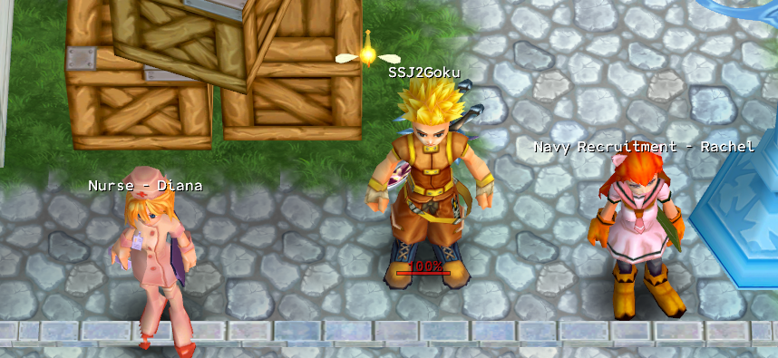

import { Aside } from '@astrojs/starlight/components';
import { Steps } from '@astrojs/starlight/components';

The default font used in Tales of Pirates is a monospaced font called `simsun`. Here is an example of how it looks in the game:



<Aside>
SimSun & NSimSun is a Simplified Chinese font features mincho (serif) stroke style.

[Read more here](https://learn.microsoft.com/en-us/typography/font-list/simsun)
</Aside>

## Modifying Fonts

Modifying the font is a very useful way to improve the readability of the game, and to make it more visually appealing.
To get started, you will need to download a font of your choice. The only catch is that it needs to be a monospaced font.
The game's engine does not handle variable width fonts very well, and can result in text having odd spaces between letters.

<Steps>
1. Download a monospaced font of your choice.

    You can find some great fonts on [Google Fonts](https://fonts.google.com/?categoryFilters=Appearance:%2FMonospace%2FMonospace) or any other font website.

2. Install the font on your computer. This is usually done by double clicking the font file and clicking "Install" or "Install Font".

    <Aside type="tip">
    * Take note of the font name listed in the font installer. This will be used later.
    * Make sure to install the font for all users, not just your user account. This is important because the game will not be able to find the font if it is only installed for your user account.
    </Aside>
    
3. Navigate to `/scripts/lua` in your game directory.
4. Open the `font.clu` file in a text editor.
    
    
    <Aside type="caution">Some servers are based on versions of TOP which have chinese characters encoded. To view the document properly, it's recommended that you change the encoding to Simplified Chinese (GB 2312)</Aside>

5. There will be multiple lines of code calling the `UI_CreateFont` function. This is where you can change the font family as well as its size.

    ```lua
    DEFAULT_FONT = UI_CreateFont("SimSun", 12, 12, 0)
    ```
6. Change **ALL** the references of `SimSun` to the **name** of the font you downloaded (step 2). For example, if you downloaded `Roboto Mono` you would change it to:

    ```lua
    DEFAULT_FONT = UI_CreateFont("Roboto Mono", 12, 12, 0)
    ```

6. Save the file and run the game. You should now be able to see the new font in the game!

    
    ___Font used: Illinois Mono___
</Steps>

### Changing font sizes

You can also change the size of the font by changing the second and third parameters in the `UI_CreateFont` function. For example, if you want to make the font bigger, you can change it to:

```lua
UI_CreateFont("Roboto Mono", 16, 16, 0)
```

## Troubleshooting

### My font is not showing up in the game!

- Make sure you have installed the font for all users, not just your user account.
- Make sure you have changed all the references to `SimSun` in the `font.clu` file to the name of the font you downloaded.
    - Some servers have multiple `font.clu` files which create more references to `SimSun` or their default font. Make sure to check all of them!
    - E.g. Pirates Online has a `font.clu` file in `/scripts/lua/` and `/scripts/lua/forms`.
- Make sure you have saved the file after making the changes.
- Make sure you have restarted the game after making the changes.

### The font looks weird in the game!

- Make sure you have downloaded a monospaced font. The game does not handle variable width fonts very well, and can result in text having odd spaces between letters.

### The font is too small/big in the game!

- Make sure you have changed the second and third parameters in the `UI_CreateFont` function to the desired size.